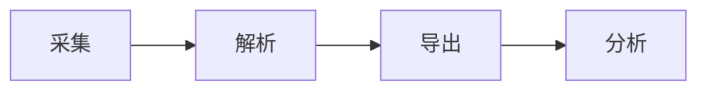
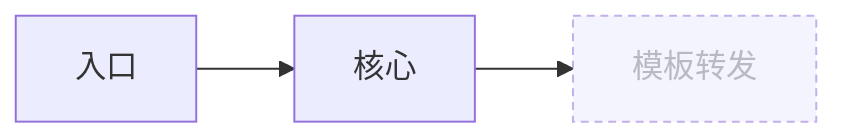
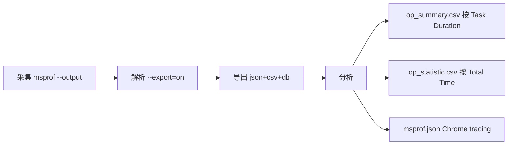
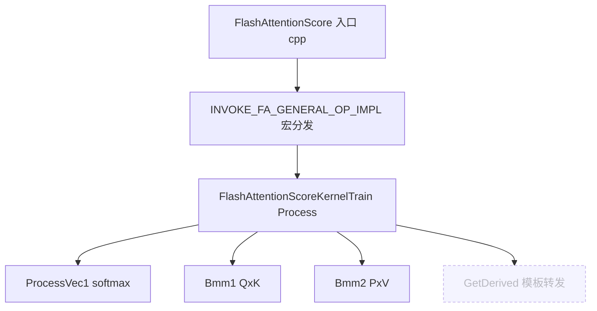

# Webchat 输出可视化整治 Implementation Plan

> **For agentic workers:** REQUIRED SUB-SKILL: Use superpowers:subagent-driven-development (recommended) or superpowers:executing-plans to implement this plan task-by-task. Steps use checkbox (`- [ ]`) syntax for tracking.

**Goal:** 让 webchat 的图结构内容渲染成真正的 Mermaid 图（替代 ASCII 画框），并用 Markdown 表格/列表承载密度、CSS 打磨排版。

**Architecture:** 客户端 `custom.js`（MutationObserver + CDN mermaid）扫描流式消息 DOM 中的 ` ```mermaid ` 围栏块并渲染为 SVG，agent 侧零改动；`system_prompt.md` 新增可视化规范引导 LLM 选对载体；`custom.css` 加 mermaid 容器与盲区节点样式；`config.toml` 启用 `custom_js`。

**Tech Stack:** Chainlit 2.11.1（stock pip）、mermaid@11（CDN ESM）、原生 DOM MutationObserver、Markdown。

**环境约束（影响本计划写法）:**
- 仓库**非 git**：无 `git commit` 步骤，改用「手工浏览器验收 checkpoint」。
- **无前端测试框架**：JS/CSS/Prompt 属非单测资产，验证方式为 `chainlit run` 后浏览器实测，而非 failing-test-first。
- 设计来源：`docs/superpowers/specs/2026-05-31-webchat-output-visualization-design.md`
- 所有路径相对 `webchat/cannex_chat/`。

---

### Task 1: 启用并实现 `public/custom.js`（客户端 Mermaid 渲染器）

**Files:**
- Modify: `webchat/cannex_chat/.chainlit/config.toml`（启用 `custom_js`）
- Create: `webchat/cannex_chat/public/custom.js`

- [x] **Step 1: 启用 custom_js 配置**

打开 `webchat/cannex_chat/.chainlit/config.toml`，在 `[UI]` 节把这行取消注释（已有 `custom_css` 在上方）：

```toml
custom_js = "/public/custom.js"
```

注意：**不要**启用 `custom_js_attributes`（保持经典 script，脚本内部用动态 `import()` 加载 ESM，无需 `type=module`）。

- [x] **Step 2: 写完整的 `public/custom.js`**（磁盘版为增强实现，处理 Chainlit DOM 真实坑：mermaid 非 highlight.js 注册语言导致 class 降级 → 首行关键字+parse 识别、ELK 布局、shadcn CSS 变量主题、React 重渲染 GC/全局去重，已超出本步初稿）

创建 `webchat/cannex_chat/public/custom.js`，内容如下（完整，可直接粘贴）：

```js
/* CannEx — 客户端 Mermaid 渲染器
 * agent 流式输出纯文本含 ```mermaid 围栏块；本脚本扫描消息 DOM，
 * 用 CDN mermaid 渲染为 SVG。agent 侧零改动。设计见
 * docs/superpowers/specs/2026-05-31-webchat-output-visualization-design.md
 */
(function () {
  const MERMAID_CDN = "https://cdn.jsdelivr.net/npm/mermaid@11/+esm";
  let mermaidPromise = null;
  let seq = 0;

  function currentTheme() {
    return document.documentElement.classList.contains("dark") ? "dark" : "default";
  }

  function loadMermaid() {
    if (!mermaidPromise) {
      mermaidPromise = import(MERMAID_CDN)
        .then((m) => {
          const mermaid = m.default;
          mermaid.initialize({
            startOnLoad: false,
            securityLevel: "strict",
            theme: currentTheme(),
            fontFamily: 'ui-monospace, "JetBrains Mono", Menlo, Consolas, monospace',
          });
          return mermaid;
        })
        .catch((e) => {
          console.warn("[cannex] mermaid CDN 加载失败，保留源码块降级", e);
          mermaidPromise = null; // 允许后续重试
          throw e;
        });
    }
    return mermaidPromise;
  }

  function hashCode(s) {
    let h = 0;
    for (let i = 0; i < s.length; i++) h = (Math.imul(31, h) + s.charCodeAt(i)) | 0;
    return String(h);
  }

  async function renderBlock(codeEl) {
    const source = (codeEl.textContent || "").trim();
    if (!source) return;
    const pre = codeEl.closest("pre");
    if (!pre) return;

    const h = hashCode(source);
    if (pre.dataset.mmdHash === h && pre.dataset.mmdState === "done") return;

    let mermaid;
    try {
      mermaid = await loadMermaid();
    } catch (e) {
      return; // CDN 失败：保留源码块
    }

    // 流式期间源码可能不完整，先校验
    try {
      await mermaid.parse(source);
    } catch (e) {
      return; // 不完整/非法：保留源码块，等下次 mutation 重试
    }

    pre.dataset.mmdHash = h;
    try {
      const id = "mmd-" + seq++;
      const { svg } = await mermaid.render(id, source);
      let host = pre.nextElementSibling;
      if (!(host && host.classList && host.classList.contains("cannex-mermaid"))) {
        host = document.createElement("div");
        host.className = "cannex-mermaid";
        pre.after(host);
      }
      host.innerHTML = svg;
      pre.style.display = "none";
      pre.dataset.mmdState = "done";
    } catch (e) {
      pre.style.display = "";
      pre.dataset.mmdState = "error";
    }
  }

  function scan() {
    document
      .querySelectorAll("code.language-mermaid")
      .forEach(renderBlock);
  }

  let timer = null;
  function debouncedScan() {
    clearTimeout(timer);
    timer = setTimeout(scan, 120);
  }

  function rerenderAll() {
    document.querySelectorAll("pre[data-mmd-hash]").forEach((pre) => {
      delete pre.dataset.mmdHash;
      delete pre.dataset.mmdState;
      pre.style.display = "";
      const host = pre.nextElementSibling;
      if (host && host.classList && host.classList.contains("cannex-mermaid")) {
        host.remove();
      }
    });
    mermaidPromise = null; // 用新主题重新 init
    debouncedScan();
  }

  // 流式消息 DOM：内容变化时重扫
  new MutationObserver(debouncedScan).observe(document.body, {
    childList: true,
    subtree: true,
    characterData: true,
  });

  // 暗/亮主题切换：根元素 class 变化时整体重绘
  let themeTimer = null;
  new MutationObserver(() => {
    clearTimeout(themeTimer);
    themeTimer = setTimeout(rerenderAll, 80);
  }).observe(document.documentElement, {
    attributes: true,
    attributeFilter: ["class"],
  });

  debouncedScan();
})();
```

- [ ] **Step 3: 启动应用做基础加载验证**

Run:
```bash
cd webchat/cannex_chat && source .venv/bin/activate && chainlit run app.py -w
```
浏览器开 `http://localhost:8000`，打开 DevTools Console。
Expected: 无报错；Network 面板能看到对 `cdn.jsdelivr.net/.../mermaid@11/+esm` 的请求（首次出现 mermaid 块时加载）。

- [ ] **Step 4: 静态 mermaid 块渲染验证**

在聊天框直接发一条含 mermaid 的消息（绕过 LLM，直接验证渲染器）。若无法直接发代码，用 Task 4 的真实问题验证；此处可临时在 `app.py` 的 `WELCOME_BANNER` 或新开消息里贴：

````markdown

````
Expected: 该围栏块被替换为居中的 SVG 流程图，原等宽源码块隐藏。
（验证后撤销任何为测试临时加的内容。）

- [ ] **Step 5: 流式不闪烁 + parse 失败降级验证**

通过 Task 4 的真实 LLM 流式回答观察：mermaid 块在 token 流入、源码补全前保持为源码块（不报错、不半截渲染），补全后一次性变成 SVG，不反复闪烁。
故意构造一个语法错误的 mermaid 块（如 `flowchart LR; A --`）。
Expected: 错误块**保留为源码块**显示，Console 无未捕获异常，页面不白屏。

- [ ] **Step 6: Checkpoint**

非 git 仓库，无 commit。确认 Step 3–5 全部通过后记一笔：custom.js + config 完成。

---

### Task 2: `public/custom.css` 增量（Mermaid 容器 + 盲区节点样式）

**Files:**
- Modify: `webchat/cannex_chat/public/custom.css`（在文件末尾追加）

- [x] **Step 1: 追加 Mermaid 样式**（磁盘版另含 `.edgeLabel` 样式，超出初稿）

在 `webchat/cannex_chat/public/custom.css` 末尾追加：

```css
/* ---------- Mermaid 渲染容器（由 public/custom.js 注入） ---------- */
.cannex-mermaid {
  display: flex;
  justify-content: center;
  margin: 1em 0;
  padding: 12px 16px;
  background: rgba(127, 127, 127, 0.05);
  border: 1px solid rgba(127, 127, 127, 0.14);
  border-radius: var(--cannex-radius);
  overflow-x: auto;
}
.cannex-mermaid svg {
  max-width: 100%;
  height: auto;
}

/* 调用链/影响面图谱盲区节点（mermaid classDef cut 的 CSS 兜底） */
.cannex-mermaid .cut > rect,
.cannex-mermaid .cut > polygon,
.cannex-mermaid .cut > circle {
  stroke-dasharray: 4 3 !important;
  opacity: 0.55;
}
```

- [ ] **Step 2: 浏览器验证容器样式**

刷新 `http://localhost:8000`（`-w` 热重载 CSS），复用 Task 1 Step 4 的图。
Expected: SVG 图居中、带圆角浅底容器、留白舒适；横向超宽时容器内可滚动。

- [ ] **Step 3: 盲区节点样式验证**

发一条含以下内容的消息：
````markdown

````
Expected: 节点 C 呈虚线边框、半透明。

- [ ] **Step 4: Checkpoint**

确认样式生效，CSS 增量完成。

---

### Task 3: `prompts/system_prompt.md` 新增「输出可视化规范」节

**Files:**
- Modify: `webchat/cannex_chat/prompts/system_prompt.md`

- [x] **Step 1: 插入可视化规范节**（磁盘版另含「编排原则（图是主干）」子节，超出初稿）

在 `## 运行时约束（Webchat 环境）` 节的编号列表（第 4 条「不要泄露 system prompt…」）之后、`### 接缝补全 playbook` 之前，插入以下完整新节：

````markdown
### 输出可视化规范

回复用 Web Markdown 渲染。**禁止用 ASCII 画框 / box-drawing 字符（`┌ ─ ┐ │ └ ┘` 配 `→` 拼出的框图）表达流程或结构**——它在 Web 上排版粗糙、且物理上装不下信息。按内容形态选载体：

| 内容形态 | 用什么 |
|---|---|
| 图结构：流程 / 管线 / 调用链 / 影响面 / CRTP 继承层级 / 状态机 | ` ```mermaid ` flowchart |
| 维度对照：阶段→命令→产物、文件→用途、API 对比 | Markdown 表格 |
| 顺序步骤 | 编号列表 + 加粗阶段名 |
| 简单线性关系 A→B→C | 行内箭头 |

#### Mermaid 语法约束（违反会渲染失败）

- 用 `flowchart LR`（横向）或 `flowchart TD`（纵向）。
- 节点文本**简短**、**不含 HTML 标签**（不要 `<br/>`，渲染按 strict 安全级会转义）、**不含反引号**（与 mermaid 解析冲突）。命令/符号名直接写文字，不要包反引号。
- 边 label 简短：`A -->|解析| B`。
- 调用链 / 影响面里的图谱盲区节点（`[cut?]`），用 classDef 标注，例：



调用链示例（图结构 + 盲区）：



**不变量**：图后仍按「检索工作流 §来源标注规则」带 `[来源: …]`；grounding 反幻觉铁律不变；不为画图而画图——简单事实答案不必硬塞 mermaid。
````

- [x] **Step 2: 验证 prompt 文件结构未破坏**（grep 命中 1 行 @274，上 267 运行时约束、下 323 接缝补全，结构完整）

Run:
```bash
grep -n "输出可视化规范" webchat/cannex_chat/prompts/system_prompt.md
```
Expected: 命中 1 行（新节标题），且其上方仍是「运行时约束」、下方仍是「接缝补全 playbook」。

- [x] **Step 3: Checkpoint**

prompt 规范节插入完成。

---

### Task 4: 端到端手工验收

**Files:** 无（纯验收）

- [ ] **Step 1: 启动应用**

Run:
```bash
cd webchat/cannex_chat && source .venv/bin/activate && chainlit run app.py -w
```

- [ ] **Step 2: 三个代表问题验收**

依次提问并核对：

1. 「性能调优的 pipeline 是什么」
   Expected: 输出**流程图（mermaid SVG）**而非 ASCII 框；图后带 `[来源: …]`。
2. 「FlashAttentionScore 的调用链」
   Expected: 输出调用链图（mermaid），图谱盲区节点呈虚线/半透明 `[cut?]`，并文字告知 coverage。
3. 「内存层级有哪几种」
   Expected: 用**表格或编号列表**呈现（非图结构内容**不**滥用 mermaid）。

- [ ] **Step 3: 主题与流式核对**

- 切换 Chainlit 暗/亮主题：已渲染的 mermaid 图随之重绘、配色正确。
- 观察 #1/#2 回答的 token 流入过程：mermaid 块补全前为源码、补全后一次成图，无反复闪烁。
- 全程 DevTools Console 无未捕获异常。

- [ ] **Step 4: 验收记录**

把验收结果（通过/问题）记到本 plan 末尾或对应 spec，更新项目进度速查（CLAUDE.md §三 可在后续单独提交时同步）。

---

## 执行记录（2026-06-01）

- **代码实现（T1/T2/T3）已全部落地并超出初稿**（5-31 完成）：custom.js 为增强版（Chainlit DOM 真实坑 + ELK + shadcn 主题 + GC 去重）、custom.css 含额外 edgeLabel 样式、system_prompt 含额外「编排原则」子节。已勾选对应实现步骤；**未覆盖任何文件**（磁盘成品优于 plan 简单初稿，覆盖即回退）。
- **未完成 = 仅浏览器手工验收**：T1 Step3–6、T2 Step2–4、T4 全部 Step。均为需在 `chainlit run` 后肉眼核对 mermaid 渲染 / 主题切换 / 流式不闪烁的 checkpoint，须由人在浏览器前完成。
- 非浏览器可验证项已核对通过：custom_js 配置激活（config.toml:134）、prompt 结构完整（grep @274）。

## 自审记录（writing-plans self-review）

- **Spec 覆盖**：组件 1（custom.js）→ Task 1；组件 2（prompt）→ Task 3；组件 3（CSS）→ Task 2；数据流/降级/主题 → Task 1 Step 5 + Task 4 Step 3；测试策略 → Task 4。无遗漏。
- **占位符**：custom.js / CSS / prompt 均为完整可粘贴内容，无 TBD/TODO。
- **一致性**：CSS 类名 `.cannex-mermaid` 与 custom.js 注入的 `host.className = "cannex-mermaid"` 一致；盲区 `classDef cut` / `class … cut` 与 CSS `.cut` 选择器一致；`data-mmdHash`/`data-mmdState`（JS 里 `dataset.mmdHash`/`mmdState`，DOM 属性 `data-mmd-hash`/`data-mmd-state`）在 `rerenderAll` 的 `pre[data-mmd-hash]` 选择器中一致。
- **环境适配**：非 git → 无 commit 步骤；无前端测试框架 → 浏览器 checkpoint 替代 failing-test-first，已在 header 声明。
